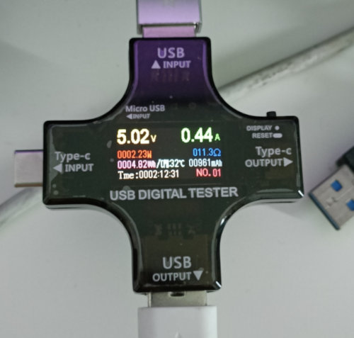
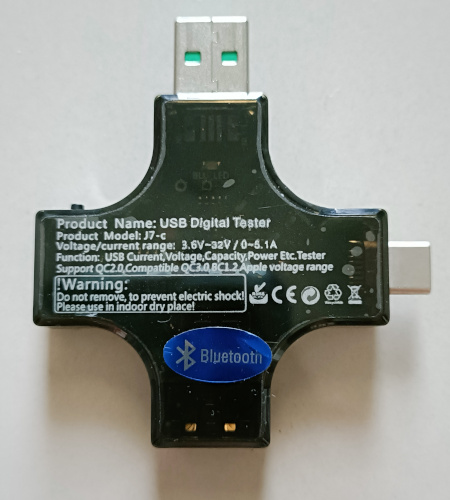
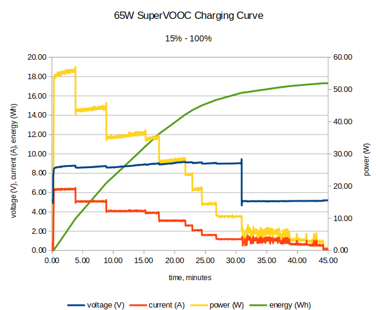

J7-C USB Tester Data Logger
---------------------------

Recently bought a J7-C USB tester  to measure charging voltage/current.

It also features Bluetooth interface to connect to Android apk or PC app for data logging.

But I'm a little squirmish about side-loading application from a dubious [mediafile folder](https://www.mediafire.com/folder/1c04afq923397/A3#v74ew1ux62x1t).

Luckily, I've found some discussion regarding the Bluetooth protocol on Arduino forum [USB Digital Tester (BT) Protocol](https://forum.arduino.cc/t/usb-digital-tester-bt-protocol/943891)

After a little experiment and reverse engineering, I've found that my device seems to output the data in a slightly different format. Once we open the Bluetooth serial port, it will send a 36-byte packet every 1 second with the following format:

| **Offset** | **Data Byte** | **Multibyte hex** | **Value** | **Data Type**             |
| ---------- | ------------- | ----------------- | --------- | ------------------------- |
| 0          | ff            |                   |           |                           |
| 1          | 55            |                   |           |                           |
| 2          | 01            |                   |           |                           |
| 3          | 03            |                   |           |                           |
| 4          | 00            | 0001f4            | 5.00      | voltage                   |
| 5          | 01            |
| 6          | f4            |
| 7          | 00            | 000034            | 0.52      | current                   |
| 8          | 00            |
| 9          | 34            |
| 10         | 00            | 000ffa            | 4090      | mAh                       |
| 11         | 0f            |
| 12         | fa            |
| 13         | 00            | 00000852          | 21.30     | energy, Wh                |
| 14         | 00            |
| 15         | 08            |
| 16         | 52            |
| 17         | 00            | 0009              | 0.09      | D+ voltage                |
| 18         | 09            |
| 19         | 00            | 000a              | 0.1       | D- voltage                |
| 20         | 0a            |
| 21         | 00            | 0020              | 32        | CPU temperature (celcius) |
| 22         | 20            |
| 23         | 00            | 00                | 03:44:44  | duration day:hh:mm:ss     |
| 24         | 03            | 03                |
| 25         | 2c            | 2c                |
| 26         | 18            | 18                |
| 27         | 3c            |                   |           |                           |
| 28         | 0c            |                   |           |                           |
| 29         | 80            |                   |           |                           |
| 30         | 00            |                   |           |                           |
| 31         | 00            |                   |           |                           |
| 32         | 03            |                   |           |                           |
| 33         | 20            |                   |           |                           |
| 34         | 00            |                   |           |                           |
| 35         | 9e            |                   |           |                           |

It does not seems to provide power value but we can easily calculate power P = V x I

So, I've written a simple python script to read the data and save it as CSV file so that it can be processed by other apps such as Excel or LibreOffice.

Here's the steps:

1. Connect to the bluetooth serial port.
2. Run `python3 j7-c_usb_tester.py --csv out.csv /dev/rfcomm0` for Linux or replace `/dev/rfcomm0` with COM port on Windows.
3. Press Ctrl-C to exit after you are done logging the data.

## Example data

Below is the charging curve for my OnePlus phone's SuperVOOC charging:

